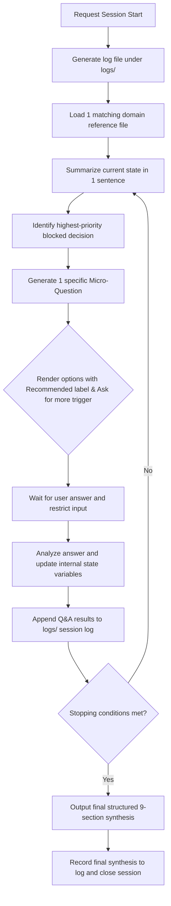

# 🎯 Ultra Grill Me (Socratic Interrogation Agent Skill)

<p align="center">
  <a href="./README.md">English</a> | <a href="./README.ko.md">한국어</a> | <a href="./README.zh.md">简体中文</a>
</p>
`ultra-grill-me` is a validation-only Agent Skill designed to stress-test your plans, designs, product ideas, GTM strategies, and personal decisions through Socratic, one-question-at-a-time interrogation before you jump into code implementation or execution.

This is a "preventative validation skill" to remove failure modes early, NOT an immediate generation utility.

---

## 1. Session Execution Loop (Mermaid Flow)

Upon activation, the agent executes the following Socratic query-answer iteration:



---

## 2. 10 Domain Reference Maps

The skill imports one of the 10 domain references based on user intent to deliver professional-grade challenges.

| Domain Area | Target Reference File | Key Questioning Principles |
| :--- | :--- | :--- |
| **Product / SaaS Idea** | [product-idea-grill.md](file:///skills/ultra-grill-me/references/product-idea-grill.md) | Persona narrowing, pain-point quantification, MVP scope cuts |
| **Technical Design** | [technical-design-grill.md](file:///skills/ultra-grill-me/references/technical-design-grill.md) | Non-functional requirements (NFRs), concurrency, data rollbacks |
| **Architecture Decision** | [architecture-decision-grill.md](file:///skills/ultra-grill-me/references/architecture-decision-grill.md) | Tradeoffs, comparing alternatives (must include status quo), reversibility |
| **Implementation Plan** | [implementation-plan-grill.md](file:///skills/ultra-grill-me/references/implementation-plan-grill.md) | Definition of Done (DoD), path scheduling, milestones, rollback protocols |
| **Business Strategy** | [business-strategy-grill.md](file:///skills/ultra-grill-me/references/business-strategy-grill.md) | Buyer vs. User split, GTM channel focus, unit pricing packaging |
| **Writing / Narrative** | [writing-direction-grill.md](file:///skills/ultra-grill-me/references/writing-direction-grill.md) | Reader knowledge level definition, core message, explicit call-to-actions (CTAs) |
| **Research Hypothesis** | [research-question-grill.md](file:///skills/ultra-grill-me/references/research-question-grill.md) | Control group baseline settings, dependent variables, statistical margins |
| **Learning Plan** | [learning-plan-grill.md](file:///skills/ultra-grill-me/references/learning-plan-grill.md) | Output verification project targets, weekly time budgets, mentors feedback |
| **Personal Decision** | [personal-decision-grill.md](file:///skills/ultra-grill-me/references/personal-decision-grill.md) | Hard constraints definition, opportunity cost, mini 1-week experiments |
| **Agent Skill Design** | [skill-design-grill.md](file:///skills/ultra-grill-me/references/skill-design-grill.md) | Scope bounding, triggers vs. non-trigger scenarios, process validation |

---

## 3. Conversation Specimen

Here is a typical interaction log showing the structure of each turn:

```
[User]: "I want to stress-test my new developer task manager app idea."
---
[Agent]:
**Current Understanding**: Validating a new developer task manager SaaS idea.

**Blocked Decision**: Target user remains too broad, preventing core MVP value definition.

**Question**: Who is the primary target developer for this MVP?

**Why it matters**: Freelancers, big-tech engineers, and indie hackers have completely different workflow bottlenecks. Defining this determines the primary MVP feature.

**Options**:
1. (Recommended) 1인 개발자 또는 인디 해커 — Focus on multiple projects and context switching
2. 5인 이하 소규모 스타트업의 풀스택 개발자 — Focus on rapid sync and collaboration
3. 대기업에 근무하는 플랫폼 엔지니어 — Focus on Jira integration and tickets
4. Ask for more recommended options
5. Answer directly

Please select a number, ask for more options, or answer directly.
```

---

## 4. `npx skill-forge` CLI Installer

Use the workspace CLI to deploy the skill to your target agent directory.

> [!NOTE]
> Setting `--lang ko` automatically translates `SKILL.ko.md` into `SKILL.md` in the destination folder, mapping all dependencies seamlessly.

```bash
# 1. Install Korean translation locally to Codex/Gemini (Default)
npx skill-forge add ultra-grill-me --lang ko

# 2. Install English version locally to Claude Code
npx skill-forge add ultra-grill-me --lang en --agent claude

# 3. Install English version locally to Cursor
npx skill-forge add ultra-grill-me --lang en --agent cursor

# 4. Install globally for all workspaces (English default)
npx skill-forge add ultra-grill-me --lang en --agent global
```

---

## 5. Logs & Evaluators

### Session Logs
- Every session generates active log outputs under `logs/` (e.g., `logs/session_YYYYMMDD_HHMMSS.md`) recording all Q&As, assumptions, and decisions to track historical changes.

### Automated Testing (Evals)
- Assert questioning structures and process adherence using the python test suite:
  ```bash
  python3 skills/ultra-grill-me/evals/check_evals.py --run-mock
  ```

---

## 6. Gotchas & Safety Rules

> [!WARNING]
> - **Adversarial Bypass Defense**: The agent will reject bypass commands (e.g., "skip questions and write the code now") and insist on resolving the single blocked decision.
> - **Code Non-Modification Policy**: Workspace source codes will not be altered during active Socratic dialogs until the user accepts the final synthesis.
