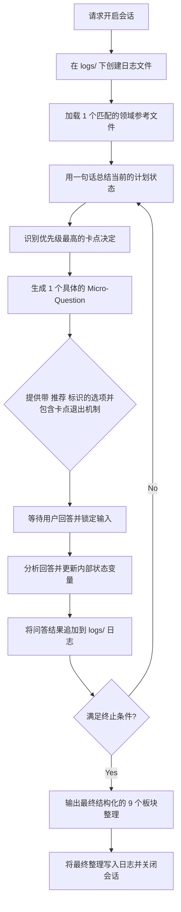

# 🎯 Ultra Grill Me (苏格拉底式压力验证 Skill)

<p align="center">
  <a href="./README.md">English</a> | <a href="./README.ko.md">한국어</a> | <a href="./README.zh.md">简体中文</a>
</p>

`ultra-grill-me` 是一个用于在计划、设计、产品创意、商业策略或个人决策实际执行之前，通过 Socratic（苏格拉底式）一次仅问一个问题的反问压力测试，消除关键模糊性和风险的验证专用 Agent Skill。

这是一种“做之前排除失败的预防性验证工具”，而**不是**代替用户直接编写或生成的工具。

---

## 1. 会话运行环路 (Mermaid Flow)

激活后，Agent 会严格执行以下苏格拉底式问答迭代：



---

## 2. 10 大验证领域与 Reference 映射

本 Skill 会根据用户请求的领域，加载精确对应的单个参考文件来提供深度的反向提问：

| 验证领域 | 目标参考文件 | 核心盘问原理与重点 |
| :--- | :--- | :--- |
| **产品 / SaaS 创意** | [product-idea-grill.md](file:///skills/ultra-grill-me/references/product-idea-grill.md) | ICP 窄化、用户痛点定量化、核心 1 个功能 MVP 边界裁切 |
| **开发实现设计** | [technical-design-grill.md](file:///skills/ultra-grill-me/references/technical-design-grill.md) | 性能等非功能性需求（NFRs）、并发/一致性、数据回滚机制 |
| **架构决定 (ADR)** | [architecture-decision-grill.md](file:///skills/ultra-grill-me/references/architecture-decision-grill.md) | 权衡（Tradeoffs）、对比备选（须含现状）、决定可逆性与代价 |
| **开发计划与里程碑** | [implementation-plan-grill.md](file:///skills/ultra-grill-me/references/implementation-plan-grill.md) | 完成定义（DoD）、任务拆解（<3天）、外部依赖风险、回滚方案 |
| **商业策略 / GTM** | [business-strategy-grill.md](file:///skills/ultra-grill-me/references/business-strategy-grill.md) | 买方与卖方分离、ICP 首批获客渠道、定价与包装匹配 |
| **写作叙事 / 定位** | [writing-direction-grill.md](file:///skills/ultra-grill-me/references/writing-direction-grill.md) | 读者知识背景对齐、单一核心传递价值、清晰的 CTA 行动 |
| **研究问题 / 假说** | [research-question-grill.md](file:///skills/ultra-grill-me/references/research-question-grill.md) | 控制变量独立性、对比基线（Baseline）、统计学显着阈值 |
| **学习计划 / 路线图** | [learning-plan-grill.md](file:///skills/ultra-grill-me/references/learning-plan-grill.md) | 可自我检验的小型玩具项目指标、每周可用时间极限、反馈源 |
| **个人决策分析** | [personal-decision-grill.md](file:///skills/ultra-grill-me/references/personal-decision-grill.md) | 个人非妥协条件、机会成本、最坏情况的微型实验体验 |
| **Agent Skill 设计** | [skill-design-grill.md](file:///skills/ultra-grill-me/references/skill-design-grill.md) | 职责收窄、触发（Trigger）与误触发场景边界、测试 Grader 逻辑 |

---

## 3. 对话实例

每一次提问迭代均遵循以下标准结构：

```
[用户]: "我想压力测试我的 Side Project 开发计划。"
---
[Agent]:
**当前理解**：验证开发计划里程碑。

**卡点的决定**：任务未充分拆解，导致开发关键路径无法识别。

**提问**：此计划中耗时最长且最不确定的单一任务是什么？

**为什么重要**：如果高风险任务被安排在后期，会导致整体项目延期。提早暴露此任务可以重新规划任务顺序。

**选择项**：
1. (推荐) 数据迁移脚本开发 — 涉及旧数据清洗，存在高风险
2. 权限校验模块集成 — 现成框架，确定性较高
3. 获取更多推荐选项
4. 直接回答

请选择编号、要求更多选项，或直接进行回答。
```

---

## 4. `npx @bhoon716/skill-forge` CLI 部署工具

使用内置 CLI 将本地化翻译自动部署到对应的本地或全局 Agent 配置路径。

> [!NOTE]
> 在执行 CLI 时指定 `--lang zh`，源目录下的 `SKILL.zh.md` 会自动以 `SKILL.md` 的名称安装到指定 Agent 路径中。

```bash
# 1. 部署中文版到本地默认项目路径 (Codex/Gemini)
$ npx @bhoon716/skill-forge add ultra-grill-me --lang zh

# 2. 部署中文版到 Claude Code 路径
$ npx @bhoon716/skill-forge add ultra-grill-me --lang zh --agent claude

# 3. 部署英文版到 Cursor 路径
$ npx @bhoon716/skill-forge add ultra-grill-me --lang en --agent cursor

# 4. 全局部署中文版至用户根路径
$ npx @bhoon716/skill-forge add ultra-grill-me --lang zh --agent global
```

---

## 5. 日志与评测

### 会话日志
- 本 Skill 的所有盘问历程将自动存储至 `logs/` 目录中（例如 `logs/session_YYYYMMDD_HHMMSS.md`），记录所有问答对和已确定的假设，以便跟踪进度。

### 自动化评测 (Evals)
- 我们可以通过运行测试评测 Grader 来确保提问格式没有退化：
  ```bash
  python3 skills/ultra-grill-me/evals/check_evals.py --run-mock
  ```

---

## 6. 注意事项与安全防范

> [!WARNING]
> - **防范流程绕过 (Adversarial Bypass)**：本 Skill 拒绝一切试图通过“跳过提问直接写计划/代码”的越轨指令，确保压力测试流程的安全性。
> - **代码安全保证**：在 Socratic 会话活动期间，在用户明确接受最终整理结果之前，Agent 绝对不会擅自修改工作区里的源码文件。
